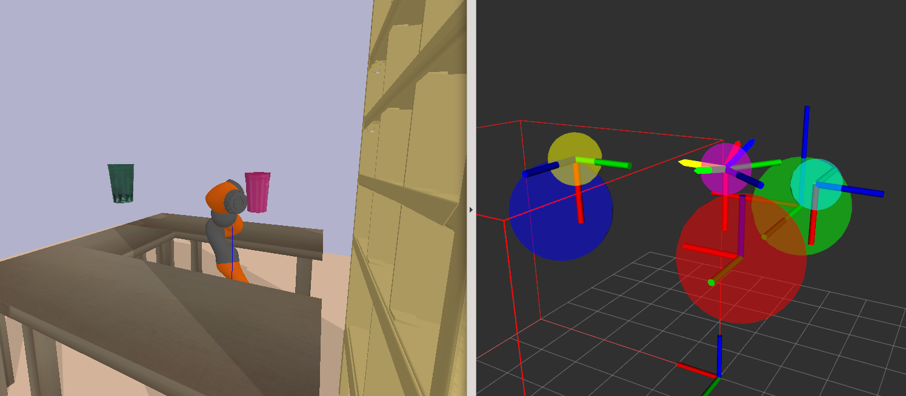

# Object Preference Adaptation (OPA)

This repo contains the source code for paper:
[Learning from Physical Human Feedback: An Object-Centric One-Shot Adaptation Method](https://arxiv.org/abs/2203.04951).
OPA is a novel object-centric adaptation method that quickly adapts policies
to learn drastically new behavior based on physical human feedback. As an object-centric
method, OPA can naturally handle changes to the environment and object poses.

## Setup

#### Minimum requirements
Please clone this repository using recursive clone to obtain the correct
submoduled libraries.
```
git clone --recurse-submodules <insert this repo http/ssh>
```
Next, install both the requirements of this repository and the submodules.
```
cd opa/
python -m pip install -r requirements.txt
python -m pip install -r pybullet-planning/requirements.txt
```
If you have an older version of cuda, you can install an older version of torch/torchvision:
```
python -m pip install torch==1.8.0+cu101 torchvision==0.9.0+cu101 -f https://download.pytorch.org/whl/cu101/torch_stable.html
```

#### 3D Visualization and Simulation
To debug model behavior in 3D, we use ROS and Rviz. ROS (any version should work) can be installed by following these
instructions: http://wiki.ros.org/melodic/Installation/Ubuntu

#### Code Linting to See Important Comments
We recommend installing text linters to distinguish the following types of comments:
- ```NOTE```
- ```TODO```
- ```# !```

## Tutorial

### General Usage

All scripts should be run from the root of the project directory using **Python 3**. Most files share a similar layout:

- Global constants are defined at the top
- Helper functions defined in the middle
- Argument parsing and main function defined at the bottom

### Synthetic Data Generation

#### Position Specific Data

We can first generate some debugging data to verify that data generation is correct. Let's start with position-only
data, generating and visualizing it afterwards.

```
python data_generation.py --is_debug
python data_generation.py --is_debug --visualize
```

A ```data``` directory with the file ```debug_data.npz``` will be created with the first command. We use the debugging
package ipdb to loop through each image one by one, and enter ```c``` into the terminal to move to the next image. You
should see something similar to the images below:

Notice how no orientation is shown, but rather expert position trajectory is shown moving closer to the green Attractor
and staying away from the red Repulsor while converging to the goal. This is used to train the Position Relation
Network.

#### Orientation Specific Data

Next, let's generate debug rotation data used to train the Rotation Network specifically. Press ```q```
to exit ipdb, and run the new command:

```
python data_generation.py --is_debug --is_rot
python data_generation.py --is_debug --visualize 
```

You should see the first two images:


**Left Image:** the expert trajectory now contains arrows indicating orientation at every few waypoints. The position
trajectory now a straight line to the goal. The green object no longer represents "Attract" in position, but rather that
we "Care" about its orientation. Notice that the green object has both a black arrow and a dark green arrow. Black
represents the actual orientation that would be observed by the agent. Dark green represents the desired orientation
that the agent should match. The agent should overall produce an orientation *relative to the object's pose*.
<br>
**Right Image:** the green "Care" object has been replaced by a red "Ignore" object, where the desired behavior is to
ignore the object's orientation. We can see that the expert trajectory indeed ignores the offset green orientation of
the object, but rather maintains its starting orientation until the goal.
<br>
Overall this data is used to train the Rotation Relation Network.

#### Generating Full Datasets

Let's now generate a full train and test dataset of position and rotation data using the below commands. By default,
3000 samples are generated for both train and test. This can take 3-8 minutes depending on your machine.

```
python data_generation.py --data_name pos_2D
python data_generation.py --data_name rot_2D --is_rot
```

Those commands have created a ```data``` directory with the folders ```pos_2D_train```, ```pos_2D_test```,
```rot_2D_train```and ```rot_2D_test```. You'll notice that each folder contains individual samples in separate
```.npz``` files. The train folders also contain a backup copy of the data generation scripts. We can optionally
visualize samples of any full dataset by running:

```
python data_generation.py --data_name <dataset_name> --visualize
```

### Policy Training/Evaluation for 2D

#### Position Relation Network

We separate training of the Position and Rotation Relation Networks into two separate phases with no specific order.
Let's first train the Position Relation Network:

```
python train.py --model_name policy_2D --data_name pos_2D 
```

This will train the Position Relation Network for 50 epochs and save model weights to a
directory ```saved_model_files/policy_2D```
every 10 epochs along with other metrics and a backup copy of training scripts. Additional hyperparameters can be
specified in the command line, but the default values are already tuned. These can be found at the bottom
of ```train.py```.

Once finished running, we can visualize the position component of the policy for any saved epoch (for example epoch 50)
on test data:

```
python viz_2D.py --model_name policy_2D --data_name pos_2D --loaded_epoch 50 --calc_pos
```

You should see the a live video similar to the below image:


Ideally, the agent converges to the goal while interacting with nearby Attractor and Repulsor objects similar to the below image.
Each object/node in the scene contributes some "force" on the agent represented
as the arrows originating from the agent. Each arrow's length is proportional
to the attention the model placed on each object. In the above image, the goal
is given the highest attention, pulling the agent towards it. The red Repel object
pushes the agent away with smaller magnitude. You can enter ```ctrl-C``` into the terminal 
to exit.

#### Rotation Relation Network

Now, let's train the rotation component of the same policy by loading model weights from the previous training session
and using the rotation data:

```
python train.py --model_name policy_2D --data_name rot_2D --loaded_epoch 50 --is_rot
```

This will similarly train the Rotation Relation Network for 50 epochs, but save
weights starting from epoch 50 and ending at epoch 100. This means that we should 
use the final epoch 100 weights for any test-time tasks involving both position and rotation.
While running this command, you'll notice that both learned and actual
rotational offsets are printed out every 10 epochs. The learned offsets are 
not predictions, but rather "network weights" updated through gradient descent.

Let's visualize the learned Rotation Relation Network:

```
python viz_2D.py --model_name policy_2D --data_name rot_2D --loaded_epoch 100 --calc_rot
```
You should see a video similar to the below image:


The pink agent's predicted orientation is shown for 5 timesteps in 
the future. Ideally, its predicted orientation direction should
match the dark purple expert. 

#### Online Adaptation
We've so far only shown pretrained behavior, assuming the correct
object features are known. Let's also check the model's ability to adapt
to new objects from expert feedback.
```
python viz_2D.py --model_name policy_2D --data_name rot_2D --loaded_epoch 100 --calc_rot --adapt
python viz_2D.py --model_name policy_2D --data_name pos_2D --loaded_epoch 100 --calc_pos --adapt
```
For rotation and position, you should see improvement in 
the model's prediction as the number of adaptation steps increases. 
You can also see the learned vs desired features printed out in the terminal.


### Policy Training/Evaluation for 3D
Let's repeat the same procedure, but now for 3D. 
#### Data Generation
```
python data_generation.py --data_name pos_3D --is_3D
python data_generation.py --data_name rot_3D --is_3D --is_rot
```
#### Train Positon and Rotation Relation Networks
```
python train.py --model_name policy_3D --data_name pos_3D --is_3D
python train.py --model_name policy_3D --data_name rot_3D --loaded_epoch 50 --is_3D --is_rot
```
We can also check that the learned rotational offsets in 3D 
are similar to the true values by uncommenting the last few lines
of ```viz_3D.py``` and following the next section's steps.

#### Evaluation
Make sure you've installed ROS and Rviz, as explained in the 
requirements section.
Open three separate terminal tabs. 
- In the first terminal, run ```roscore```
- In the second terminal, run (from this repo's root directory) 

  ```rosrun rviz rviz -d rviz_config.rviz``` 
- In the third terminal, run

  ```python viz_3D.py --model_name policy_3D --data_name pos_3D --loaded_epoch 100 --calc_pos```

Upon running, you should see a new Rviz window show up 
with a scene similar to the below image. You can left and middle-click to
change camera view. 


This colors of objects are the same as what we've
seen for 2D above. The pink Agent navigates from blue
Start to yellow Goal while interacting with a nearby green Attractor
and red Repulsor object. Each object's 3D pose is shown
in the center of each object. The full expert trajectory is shown as the 
thin blue line connect start to goal. The agent's rollout is 
shown as the thicker pink line.

Let's also verify behavior for the Rotation Relation Network by
replacing the third terminal's command with:
```
python viz_3D.py --model_name policy_3D --data_name rot_3D --loaded_epoch 100 --calc_rot
```
You should see a video similar to the below image:


To compare expert vs agent orientation, look at the two coordinate
axes centered on the agent. The thicker, shorter axes are the expert's
whereas the thinner, longer axes are the agent's. 

Overall, this visualization tool will be extremely useful in debugging the 3D policy's behavior.

### Robotic Simulation with Human Feedback
Enough with the debugging visualizers... let's test the policy's
performance using real human feedback in a simulation! 
#### Debugging and Parameter Tuning
Transferring
behavior from simple spheres to actual environments with real
objects is not easy, and you will need to tune some parameters. Here are 
some tips:
- After training the 3D policy, you need to find position/rotation preference
values for "Ignore" behavior. This is how the robot should reasonably treat any new object 
it encounters. Uncomment the first section 
of code at the bottom of ```viz_3D.py``` to set object feature values as ignore. 
The run the command: 
  ```
  python viz_3D.py --model_name policy_3D --data_name rot_3D --loaded_epoch 100 --calc_pos --calc_rot
  ```
  Then look inside ```Policy().__init__()``` of ```model.py``` to tune parameters "a" and "b". 
  Ideally, the agent should move straight through objects with 
  small position forces and also ignore their orientation.
- It's useful to visualize the gradients for object features during adaptation
  as well as their initial and final values. In each of the three experiment
  files, look for where ```perform_adaptation()``` is called, and specify ```verbose=True```
  to view adaptation gradient and loss values.
- Viewing the adaptation loss, if you notice that loss is still decreasing
  at the final adaptation step, try increasing the number of adaptation steps.
  Adaptation is performed using a fixed, high learning rate of 1e-1 with Adam. 
  Feel free to modify this and add learning rate schedulers.

#### Running the Experiments 
There are three experiment files: ```exp1_cup_low_table.py```, ```exp2_inspection.py```, and ```exp3_scanning_item.py```
following the order of experiments in the paper. The beginning of each's ```main()``` function
will have specific details on how to perturb the robot and how the scene is overall setup. Any can
be run using the following general command:
```
python <experiment script.py> --model_name policy_3D --loaded_epoch 100
```
An optional, but extremely useful debugging tool is to add ```--view_ros``` to the command
to view what the model predicts. DON'T FORGET to run roscore and rviz, as explained above in 3D Evaluation.
```
python <experiment script.py> --model_name policy_3D --loaded_epoch 100 --view_ros
```
Some robot-specific errors can arise, such as Inverse Kinematics (IK) failures. 
Unfortunately, there is no easy workaround these, and you should just reset the 
experiment run if this happens.

Here are pictures of the three experiment scenes with their ROS Rviz shown to the right:




## What Next?
Now that you've finished the tutorial, you can
extend this general framework for your own purposes.
- Use your own dataset: synthetic or real human demonstrations
- Experiment with other architectures
- Learn more complex behavior under the object-centric paradigm 
  - Trajectories more complex than repel/attract
  - Dynamic motion: velocity, acceleration, etc.
- Apply safety constraints to control (e.g. collision avoidance)


## Citation
If you found this paper/repository useful, please cite:
```
@misc{opa2022,
  title = {Learning from Physical Human Feedback: An Object-Centric One-Shot Adaptation Method},
  author = {Shek, Alvin and Chen, Rui and Liu, Changliu},
  url = {https://arxiv.org/abs/2203.04951},
  year = {2022}
}
```
